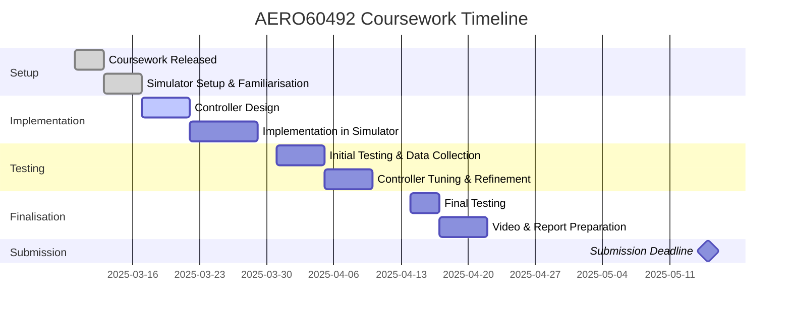

# AERO60492 Coursework 3 – UAS Feedback Control

## Overview 

This repository contains the implementation of a feedback control algorithm for position stabilisation of an Unmanned Aerial System (UAS), developed as part of the AERO60492 – Autonomous Mobile Robots coursework.

The project focuses on designing a controller that processes sensor feedback (position, velocity, attitude) and generates actuation commands to drive the UAV to a desired target position.

## Project timeline

