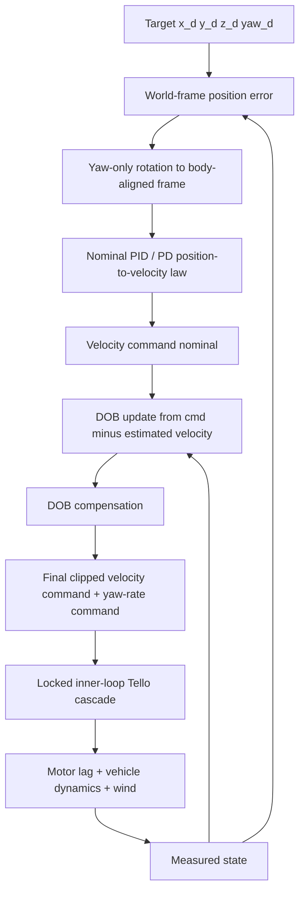

# Outer-loop Control Algorithm for AERO60492 Coursework 3  
## Yaw-aligned Position–Velocity Cascade with DOB Assistance under Fast-Varying Wind

This document explains the control logic implemented in `controller.py`, and more importantly, the **practical reasoning behind the final design choices** for this coursework platform.

The controller is built around a **yaw-aligned outer-loop position controller** that outputs body-frame velocity commands and a yaw-rate command. A lightweight **disturbance observer (DOB)** is optionally used to compensate persistent wind-induced tracking mismatch.

The key conclusion of this project is that, on this simulator/UAV stack, **controller performance is limited less by the nominal PID formula itself, and more by the interaction between**:

1. the **physics step and command holding**,  
2. the **locked inner-loop bandwidth**,  
3. the **velocity saturation / clipping**, and  
4. the **time-varying wind field**, especially gust-like direction and magnitude changes.

---

## 1. System overview

The coursework interface asks us to design a controller that maps:

- current state: position and attitude,
- desired reference: `(x_d, y_d, z_d, yaw_d)`,

into:

- commanded velocity: `(v_x, v_y, v_z)`,
- commanded yaw rate: $\dot{\psi}_{\mathrm{cmd}}$.

The full stack is a **cascade**:

```text
Target position/yaw
        |
        v
+-------------------------+
| Outer loop (controller) |
| pos error -> vel_cmd    |
| yaw error -> yaw_rate   |
+-------------------------+
        |
        v
+---------------------------+
| Inner loop (Tello stack)  |
| vel PID -> accel demand   |
| accel -> angle/thrust     |
| angle PID -> rate demand  |
| rate PID -> torque / rpm  |
+---------------------------+
        |
        v
+---------------------------+
| Airframe + motor lag +    |
| drag + wind disturbance   |
+---------------------------+
        |
        v
Measured state
```

So even though the outer loop only outputs velocity commands, the true plant seen by the outer loop is **not an ideal integrator**, but a delayed and saturated cascade.

---

## 2. Coordinate-frame choice

The coursework hint explicitly warns that axis transformation matters.

The position measurement is given in the **world frame**, but the Tello command interface is effectively interpreted in a **yaw-aligned body frame**:

- command forward/backward should follow current heading,
- command left/right should stay lateral relative to yaw,
- roll and pitch are not part of the control-frame definition for the high-level velocity interface.

Therefore, world-frame position error is rotated by yaw only:

$$
\mathbf{e}_p^{w} = \mathbf{p}_d - \mathbf{p}
$$

$$
\mathbf{e}_p^{b_y} = R_{w\to b_y}(\psi)\,\mathbf{e}_p^{w}
$$

with

$$
R_{w\to b_y}(\psi)=
\begin{bmatrix}
\cos\psi & \sin\psi & 0 \\
-\sin\psi & \cos\psi & 0 \\
0 & 0 & 1
\end{bmatrix}
$$

This gives intuitive horizontal control in the current heading direction, without mixing in roll/pitch tilt.

---

## 3. Nominal outer-loop law

The nominal outer loop is a position-to-velocity cascade:

$$
\mathbf{v}_{\mathrm{cmd,nom}} = K_p \odot \mathbf{e}_p^{b_y} + K_i \odot \mathbf{I}_p - K_d \odot \hat{\mathbf{v}}^{b_y}
$$

where:

- $K_p$: position gain,
- $K_i$: integral gain,
- $K_d$: damping on estimated velocity,
- $\mathbf{I}_p$: clipped integral state,
- $\hat{\mathbf{v}}$: estimated or measured velocity.

Yaw is controlled separately:

$$
\dot{\psi}_{\mathrm{cmd}} = \mathrm{clip}\left(K_{p,\psi} e_\psi + K_{i,\psi} I_\psi + K_{d,\psi}\dot{e}_\psi\right)
$$

with wrapped yaw error:

$$
e_\psi = \mathrm{wrap}(\psi_d - \psi)
$$

In principle this is straightforward cascade PID. In practice, however, the most important issue is **what plant this outer loop is actually commanding**.

---

## 4. Why the nominal 1000 Hz / 50 Hz interpretation is misleading

At first glance the code suggests:

- inner loop: `1000 Hz`,
- outer loop: `50 Hz`.

However, in `run.py` the *labels* “1000 Hz” and “50 Hz” are **nominal loop timers**, while the *actual* state update rate is set by the simulator’s physics stepping.

In this coursework harness, the main loop calls `p.stepSimulation()` once per iteration and sleeps to target:

$$
\Delta t_{\mathrm{loop,nom}} = \frac{1}{1000}\;\text{s}
$$

but unless the physics timestep is explicitly set, PyBullet typically advances with its default step:

$$
\Delta t_{\mathrm{phys}} \approx \frac{1}{240}\;\text{s}
$$

The position (outer) controller is executed every

$$
N=20
$$

loop iterations (see `steps_between_pos_control`), so the *real elapsed time* between two outer-loop updates is approximately

$$
\Delta t_{\mathrm{outer,real}} \approx N\,\Delta t_{\mathrm{phys}} \approx \frac{20}{240}=0.0833\;\text{s}
$$

This is why “50 outer-loop updates” are **not** \(1\) second of simulated time, but roughly:

$$
50 \times 0.0833 \approx 4.166\;\text{s}
$$

The critical issue is therefore not “inner vs outer step counting” itself, but **a timestep mismatch**: the simulator evolves with \(\Delta t_{\mathrm{phys}}\), while the controller may compute derivatives/leaks using an assumed \(\Delta t\) (e.g. \(1/50\) s). If \(\Delta t\) is underestimated by a factor of about \(4.166\), then finite-difference derivatives (and any \(\exp(-\lambda \Delta t)\) leak) are scaled incorrectly, which most visibly distorts the **D-term** and makes tuning misleading.

In our final implementation, the outer-loop computations use \(\Delta t \approx 0.0833\) s (i.e. \(20/240\) s) to match the effective update interval, preventing the derivative estimate from being inflated by \(\approx 4.166\times\).

### Why this matters

This changes the meaning of tuning:

1. **Derivative / leak terms are only meaningful if \(\Delta t\) is correct**. A \(\Delta t\) mismatch directly rescales finite-difference derivatives (and exponential leaks), so the effective D action can be off by a factor of \(\approx 4.166\).
2. **Outer-loop commands are held for \(N\) physics steps**, so aggressive gains create sample-and-hold forcing.
3. The outer loop does not see an ideal velocity servo; it sees a **lagged, clipped, bandwidth-limited plant**.

That is the main reason a theoretically “reasonable” aggressive outer PID often becomes oscillatory in this coursework.

---

## 5. Inner-loop limitation is the dominant bottleneck

The inner Tello stack is effectively fixed for this assignment. It contains its own cascade:

```text
velocity error -> accel PID
accel demand   -> desired angle / thrust
angle error    -> angle PID -> desired rate
rate error     -> rate PID  -> motor torques
motor lag      -> realized thrust/torque
```

This means the outer loop is **not directly commanding acceleration**, only a velocity reference that must pass through several stages before the drone actually changes motion.

### Practical consequence

If the outer loop becomes too aggressive:

- the velocity request clips,
- the inner loop cannot track the demanded change quickly enough,
- the outer loop keeps seeing large error,
- more command is accumulated,
- oscillation or repeated saturation appears.

In other words, **inner-loop performance is effectively locked**, so the outer-loop gains must remain relatively conservative.

This is not just a tuning inconvenience; it fundamentally weakens pure PID wind rejection.

---

## 6. Why pure PID wind rejection is limited here

For a simplified translational axis, the dynamics can be written as:

$$
m\ddot{x} = u + d
$$

where:

- $u$ is the control effect delivered through the inner loop,
- $d$ is the unknown disturbance, here dominated by wind.

A PID outer loop only reacts through the tracking error. It does **not** explicitly estimate the disturbance.

Under this coursework stack, pure PID struggles for three reasons:

### 6.1 Saturation and clipping
The outer loop command is clipped to allowable velocity limits. Once clipped, increasing the PID output further does not produce stronger actuation.

### 6.2 Inner-loop bandwidth limit
Even before clip, the inner loop cannot instantaneously realize the requested velocity change. So the outer-loop error persists longer than an ideal model predicts.

### 6.3 Fast-varying wind
If the wind direction and magnitude change quickly, then by the time the integral term builds up enough compensation, the disturbance may already have changed.

Therefore, pure PID can reduce average bias, but its wind rejection is weakened by the **combination of delay, saturation and disturbance variation**.

---

## 7. Wind model and why DOB is still relevant

The simulator wind is not just a constant bias. It contains:

1. a slowly varying steady component,  
2. directional variation,  
3. intermittent gust-like components.

Conceptually, wind acts as an **additive external force** on the body:

$$
m\ddot{\mathbf{p}} = \mathbf{u} + \mathbf{d}_w(t)
$$

This is exactly the type of disturbance for which DOB-style compensation is attractive.

### Important nuance

DOB is most naturally suited for:

- **persistent** disturbances,
- **slowly varying** disturbances,
- disturbances that appear approximately as an additive input mismatch.

The coursework wind satisfies this only **partially**:

- the slowly varying component is DOB-friendly,
- but the faster direction/magnitude changes are harder to track.

So the correct conclusion is not “DOB solves wind completely”, but rather:

> DOB is suitable because wind enters as an external disturbance and contains a significant low-frequency component, but its effectiveness is limited when the wind changes faster than the observer-inner-loop-outer-loop cascade can respond.

---

## 8. Disturbance observer formulation used here

Instead of trying to identify physical wind force directly, the controller estimates an **equivalent disturbance** from the mismatch between expected and observed motion.

Define a velocity mismatch in yaw-aligned body frame:

$$
\mathbf{e}_v = \mathbf{v}_{\mathrm{cmd,nom}} - \hat{\mathbf{v}}^{b_y}
$$

The observer state evolves as:

$$
\dot{\hat{\mathbf{d}}} = K_{\mathrm{dob}} \odot \mathbf{e}_v - \Lambda \odot \hat{\mathbf{d}}
$$

Discrete update:

$$
\hat{\mathbf{d}}_{k+1} = \hat{\mathbf{d}}_{k} + \Delta t\left(K_{\mathrm{dob}}\odot \mathbf{e}_v - \Lambda\odot \hat{\mathbf{d}}_{k}\right)
$$

where:

- $K_{\mathrm{dob}}$ controls how aggressively mismatch is interpreted as disturbance,
- $\Lambda$ is a leak term that prevents drift,
- $\hat{\mathbf{d}}$ is clipped to prevent runaway compensation.

The final command is:

$$
\mathbf{v}_{\mathrm{cmd}} = \mathbf{v}_{\mathrm{cmd,nom}} + K_{\mathrm{comp}}\odot \hat{\mathbf{d}}
$$

So the observer acts as a **feedforward correction on top of the nominal PID law**.

---

## 9. Why pure DOB is also not enough

A useful way to understand the limitation is through bandwidth.

Suppose the actual wind disturbance is:

$$
\mathbf{d}_w(t)
$$

The controller can only reject the portion of this disturbance that lies within the effective bandwidth of:

1. the observer update,
2. the outer-loop sample rate,
3. the inner-loop tracking bandwidth,
4. the actuator saturation limits.

If wind changes faster than this cascade can respond, then:

$$
\hat{\mathbf{d}}(t) \not\approx \mathbf{d}_w(t)
$$

and compensation becomes delayed or inaccurate.

### In practical coursework terms

- slow drift wind → DOB helps clearly,
- moderate gust → DOB helps partially,
- fast direction switching / sharp gust envelope → DOB cannot fully keep up.

So a purely DOB-based strategy without respecting the limited inner-loop response can also become unstable or ineffective.

---

## 10. Final control philosophy adopted

The best practical strategy is therefore **not** “make PID aggressive” and **not** “rely entirely on DOB”, but:

### 10.1 Conservative nominal outer-loop PID
Use moderate gains so the inner loop is not constantly saturated.

### 10.2 DOB as auxiliary disturbance rejection
Use DOB to compensate the **persistent or slowly varying part** of the mismatch.

### 10.3 Saturation-aware tuning
Treat clipping as part of the plant, not as an afterthought.

### 10.4 Yaw-aligned motion decomposition
Reduce unnecessary cross-axis coupling by commanding in the correct frame.

This gives the following conceptual structure:



If Mermaid rendering is unavailable, the same logic can be read in Simulink-like block form:

```text
r = [x_d,y_d,z_d,yaw_d]
          |
          v
   (+) position error in world frame
          |
          v
 yaw-only coordinate transform
          |
          v
   PID / PD position controller ----------------------+
          |                                           |
          v                                           |
   nominal velocity command                           |
          |                                           |
          +----> mismatch with estimated velocity ----+
                          |
                          v
                    DOB update law
                          |
                          v
                    disturbance estimate
                          |
                          v
                 compensation feedforward
                          |
                          v
                 saturation / clipping block
                          |
                          v
                    inner-loop Tello plant
                          |
                          v
                     drone + wind dynamics
                          |
                          v
                      measured state
```

---

## 11. Tuning implications

Because the inner loop is the limiting factor, tuning should follow this order:

### Step 1. Tune nominal outer loop without DOB
Goal: get stable position convergence with minimal saturation.

What to watch:

- does the command hit clip frequently?
- does the drone oscillate near the target?
- does velocity tracking lag badly?

If yes, reduce horizontal aggressiveness first.

### Step 2. Add DOB gradually
Only after the no-wind or low-wind nominal controller is stable.

What to watch:

- persistent drift reduced or not,
- overshoot increase after compensation,
- observer estimate becoming noisy or biased.

### Step 3. Evaluate under changing wind, not just constant wind
A controller that rejects a constant bias may still perform poorly when wind rotates or gusts.

### Step 4. Judge by steady accuracy and consistency
The marking criteria reward not only mean error but also standard deviation. A controller that is very aggressive but oscillatory is often worse than a slightly slower, more consistent one.

---

## 12. Main practical insights from this project

### Insight 1
The simulator should be understood as a **discrete-time cascade tied to physics stepping**, not as a nominal 1000/50 Hz ideal hierarchy.

### Insight 2
The **locked inner-loop bandwidth** is the strongest constraint on outer-loop tuning.

### Insight 3
Because commands clip easily, pure PID wind rejection is weaker than textbook intuition suggests.

### Insight 4
DOB is suitable because wind acts as an additive disturbance and has a low-frequency component, but DOB cannot perfectly reject rapidly varying wind.

### Insight 5
The best performance comes from a **balanced combination**:

- correct frame transformation,
- conservative nominal outer-loop tuning,
- limited but useful DOB compensation,
- explicit awareness of clip and delay.

---

## 13. Suggested wording for video/report

A concise explanation suitable for the 3-minute video is:

> Our controller is a yaw-aligned outer-loop position-to-velocity cascade.  
> Position error is first transformed into the yaw-aligned body frame, so forward and lateral velocity commands remain meaningful as the UAV turns.  
> A nominal PID or PD law generates the desired translational velocity, while yaw is controlled separately by a yaw-rate loop.  
>  
> In practice, the main difficulty was that the inner Tello cascade is effectively fixed and bandwidth-limited, so an aggressive outer loop quickly causes clipping and oscillation. This means the outer loop must be tuned more conservatively than an ideal model would suggest.  
>  
> To improve wind rejection, we added a disturbance observer that estimates an equivalent disturbance from the mismatch between commanded and observed motion. This works well for persistent or slowly varying wind, because wind enters as an external force. However, the simulator wind also changes direction and magnitude, so pure DOB compensation cannot fully keep up with the fastest variations.  
>  
> Therefore, the final controller uses moderate nominal gains plus DOB assistance, rather than relying on either aggressive PID or pure observer compensation alone.

---

## 14. Final summary

This coursework is not simply a PID tuning exercise. It is a practical demonstration that:

- the **effective sample rate** matters,
- the **inner-loop plant seen by the outer loop is not ideal**,
- **saturation changes controller behaviour significantly**, and
- **advanced methods like DOB help only when their assumptions match the disturbance timescale**.

The final controller design is therefore a compromise between:

- response speed,
- stability,
- anti-wind capability,
- and consistency under repeated random target tests.

That trade-off is exactly the main engineering lesson of this assignment.
